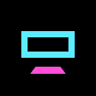

  

<h1 align="center">NoctDock</h1>

<strong>A local wireless dock for Android gaming handhelds.</strong>

  <a href="https://glowseedstudio.github.io/noctdock/">Project page</a>

NoctDock lets an Android handheld send its screen to another display on your local network, while the handheld stays in your hands as the controller.

Open the receiver on a TV, Shield, Android tablet, phone, or other supported display. Open the sender on your handheld. Pair once. Play like your handheld is docked.

No accounts. No cloud relay. No ads. No analytics.

---

## Why I made this

I started NoctDock because I love Android gaming handhelds, but I kept running into the same problem: these devices are powerful enough to feel like little consoles, yet they are still mostly treated like small-screen-only devices.

I wanted something that felt closer to a real docked-console experience — not Chromecast-style mirroring, not remote desktop, not another cloud gaming service, and not something that needs a login or a server. Just **my handheld, my local network, my screen, my controller.**

The idea grew from a simple question: *what if a Retroid, Odin, or similar Android handheld could behave more like a wireless console?*

NoctDock is my attempt to build that properly and share it with the community. It is still in active development, but the goal is simple: make Android handhelds feel more flexible, more console-like, and more useful with the screens people already own.

---

## What it does

NoctDock is split into a few parts. **NoctDock Sender** runs on the Android handheld. **NoctDock Receiver** runs on the TV, Shield, Android TV, phone, tablet, or display device. **NoctDock Core** holds the shared local protocol, profiles, discovery, pairing, and diagnostics. **NoctDock Azahar** is a separate Azahar fork for experimental 3DS top-screen projection.

The main experience is straightforward: start the receiver on your display, start the sender on your handheld, pair once, pick what to play, and enter Console Mode. Everything stays on your local network.

---

## What NoctDock is not

NoctDock is not a cloud gaming service. It does not use an online account, upload your games, scrape a game database, collect analytics, or depend on a remote server. It is designed around local play, local discovery, and local control.

---

## Main features

| Feature | What it does |
| --- | --- |
| **Local discovery** | Finds receivers on your local network automatically using mDNS. |
| **Pair once** | Uses a short pairing code, then remembers trusted screens locally. |
| **Console Mode** | Captures and streams from the handheld to the receiver with hardware encoding. |
| **Game Hub launcher** | A console-style launcher for apps, emulators, favourites, and recent games. |
| **AVC / HEVC support** | Chooses the best supported codec and falls back when needed. |
| **Console profiles** | Performance, Balanced, Quality, Sharp, Cinema, and hidden experimental modes. |
| **TV / receiver audio** | Optional sound modes depending on what Android allows. |
| **Screen Cloak** | Darkens the handheld while playing on another screen without darkening the stream. |
| **Test My Connection** | Checks the local network and recommends a suitable Console Mode. |
| **System Status** | Real diagnostics for troubleshooting without exposing private data. |
| **Android-to-Android receiver** | Use another phone or tablet as a display. |
| **NoctDock Azahar mode** | Experimental 3DS top-screen projection through a custom Azahar fork. |

---

## Console profiles

NoctDock uses profiles instead of exposing a wall of encoder settings.

| Profile | Resolution | FPS | Purpose |
| --- | --- | ---: | --- |
| **Performance** | 1280×720 | 60 | Lowest-latency fallback. |
| **Balanced** | 1280×720 | 60 | Recommended default. |
| **Quality** | 1280×720 | 60 | Cleaner 720p picture. |
| **Sharp** | 1600×900 | 60 | Better clarity for strong local networks. |
| **Cinema** | 1920×1080 | 60 | Full HD when the receiver and network can handle it. |
| **1080 Boost** | 1920×1080 | 60 | Hidden compatibility/test mode. |
| **Extreme** | 1920×1080 | 60 | Hidden experimental mode. |

Higher is not always better. NoctDock is built to favour smooth play over chasing numbers. If the connection struggles, it should recommend a safer profile instead of silently making the picture ugly or unstable.

---

## Sender app

The sender runs on the handheld. It handles receiver discovery, pairing, trusted screens, Console Mode, the app and game launcher, stream profiles, audio modes, Screen Cloak, the 60 Hz helper, connection testing, and system diagnostics.

The Home screen is being shaped around a console-style launcher rather than a technical dashboard. The goal is for it to feel natural on handheld controls, with D-pad navigation, big focused cards, favourites, and a clear “play on screen” flow.

---

## Receiver app

The receiver runs on the display device — Google TV, Android TV, NVIDIA Shield, Android phones and tablets, and other Android devices that can run the receiver.

It waits for a handheld, shows a pairing code when needed, then plays the stream fullscreen. It also handles reconnects, fit and fill scaling, receiver feedback, audio playback, friendly overlays, and System Status diagnostics. For the best 1080p testing, Ethernet on the receiver is recommended when available.

---

## NoctDock Azahar

**[NoctDock Azahar](https://github.com/glowseedstudio/noctdock-azahar)** is a separate Azahar fork for a more natural 3DS-style setup: top screen on the receiver, bottom screen stays on the handheld, touch and controls remain local.

This is separate from the main NoctDock app so the emulator stays cleanly separated, properly attributed, and easier for the community to work on. The current direction is to avoid slow frame readback where possible and render directly into an encoder surface for better performance.

Repository: https://github.com/glowseedstudio/noctdock-azahar

---

## Privacy

NoctDock is built around a simple privacy promise: **local network only.** No accounts, analytics, ads, cloud relay, external game database, or telemetry uploads. The installed app library, trusted screens, settings, and diagnostics stay on the device unless you choose to share a support report in a GitHub issue.

---

## Current status

NoctDock is in active development. The project currently includes separate sender, receiver, and shared core modules; local discovery and pairing; AVC and HEVC streaming work; reconnect and rebroadcast hardening; connection testing; Game Hub launcher work; Screen Cloak; 60 Hz helper; Android TV and Google TV receiver support; phone and tablet receiver support; and NoctDock Azahar integration work.

Source and release builds will be published as the project stabilises.

---

## Why open source?

I am making this open source because this started as something I wanted for my own handheld, but it feels like the kind of thing other Android handheld users might want too. There are a lot of clever people in the handheld and emulation community. If NoctDock can become useful, improve, or inspire better local-play tools, then sharing it is the right thing to do.

This is not meant to replace existing emulators, launchers, or streaming tools. It is meant to sit beside them and make Android handhelds more flexible. Contributions, testing, device reports, and ideas are welcome.

---

## Project principles

Local-first and community-friendly: no accounts, no cloud dependency, no ads, no analytics, no unnecessary permissions. Performance before flashy features, smooth play before maximum numbers, and keeping the handheld feeling like a console.

---

## Roadmap

Ongoing areas include more receiver testing, a stronger Android handheld support matrix, improved Game Hub launcher polish, better profile recommendations from real network tests, continued NoctDock Azahar optimisation, Linux receiver exploration, and more device-specific tuning for Retroid, AYN, AYANEO, Anbernic, Shield, and others.

---

## Contributing

NoctDock is still young, so the most useful help right now is testing on real devices, reporting receiver compatibility, sharing Stream Watch or System Status reports, trying different routers and Wi‑Fi setups, improving documentation, cleaning code, and helping with Android media/codec or Azahar export performance.

When opening an issue, please include device model, Android version, receiver type, network setup, selected profile, and whether you were on Wi‑Fi or Ethernet. See [CONTRIBUTING.md](CONTRIBUTING.md) when it is published with the source tree.

---

## Links

| | |
| -- | -- |
| **NoctDock Azahar** | https://github.com/glowseedstudio/noctdock-azahar |
| **Project page** | https://glowseedstudio.github.io/noctdock/ |

## License

Apache License 2.0 — see [LICENSE](LICENSE).
